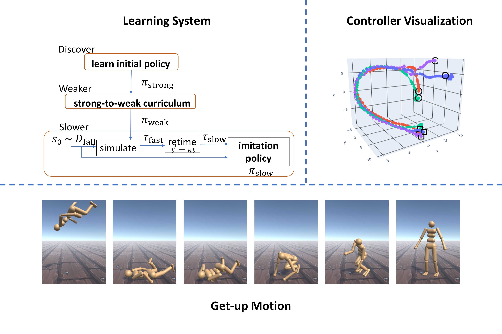

# Learning to Get Up

This repository contains code for the SIGGRAPH 2022 submission ***Learning to Get Up***. <br /> 


### Abstract:
Getting up from an arbitrary fallen state is a basic human skill. Existing methods for learning this skill often generate highly dynamic and erratic get-up motions, which do not resemble human get-up strategies, or are based on tracking recorded human get-up motions. In this paper, we present a staged approach using reinforcement learning, without recourse to motion capture data. The method first takes advantage of a strong character model, which facilitates the discovery of solution modes. A second stage then learns to adapt the control policy to work with progressively weaker versions of the character. Finally, a third stage learns control policies that can reproduce the weaker get-up motions at much slower speeds. We show that across multiple runs, the method can discover a diverse variety of get-up strategies, and execute them at a variety of speeds. The results usually produce policies that use a final stand-up strategy that is common to the recovery motions seen from all initial states. However, we also find policies for which different strategies are seen for prone and supine initial fallen states. The learned get-up control strategies have significant static stability, i.e., they can be paused at a variety of points during the get-up motion. We further test our method on novel constrained scenarios, such as having a leg and an arm in a cast.

---

## Usage of the code

### Install the dependencies
To install the python dependencies, you can create a new virtual environment then install the necessary packages:

```python
python3 -m venv python_env
source python_env/bin/activate
pip install --upgrade pip
pip install -r requirements.txt
```

This setup is tested on *Ubuntu 18.04* with *Python 3.8*


---
### Test

There is a pretrained model saved under `experiment/pretrained_model`. The *WEAK* policy is stored under `experiment/pretrained/teacher` while the final *SLOW* policy is stored under `experiment/pretrained/student`.

To reproduce the get-up motions at different speeds shown in the paper, you can run the following command:
```python
python3 main.py --teacher_student --teacher_dir experiment/pretrained/teacher --load_dir experiment/pretrained/student --test_policy --target_speed 0.5
```
This command will generate a new folder under the `experiment`

`--target_speed` is to specify the desire speed for the get-up motion, the pretrained controller can take value form `[0.2, 0.8]`.

`--to_file` is to save the rotation of the joints as `.npy` files.

---
### Training

To train the *WEAK* policy, you can run the following command:
```python
python3 main.py --power 1.0 --power_end 0.4 --discount 0.97 --actor_lr 1e-5  --env HumanoidStandup
```

To train the *SLOW* policy after the *WEAK* policy, you can run:
```python
python3 main.py --teacher_student --teacher_dir PATH_TO_TEACHER_POLICY --discount 0.95 --actor_lr 1e-5 --fast_speed 0.8 --slow_speed 0.2  --env HumanoidStandup
```
To try other variants of the humanoid model, replace `--env HumanoidStandup` with `--env HumanoidVariantStandup --variant Disabled` for the one with an arm and a leg in a cast, and `--env HumanoidVariantStandup --variant Noarm` for the one with one missing arm.

---
### Acknowlegements

The code builds upon the following work:
1. [Soft Actor-Critic (SAC) implementation in PyTorch](https://github.com/denisyarats/pytorch_sac)
2. [dm_control: DeepMind Infrastructure for Physics-Based Simulation](https://github.com/deepmind/dm_control)

---
