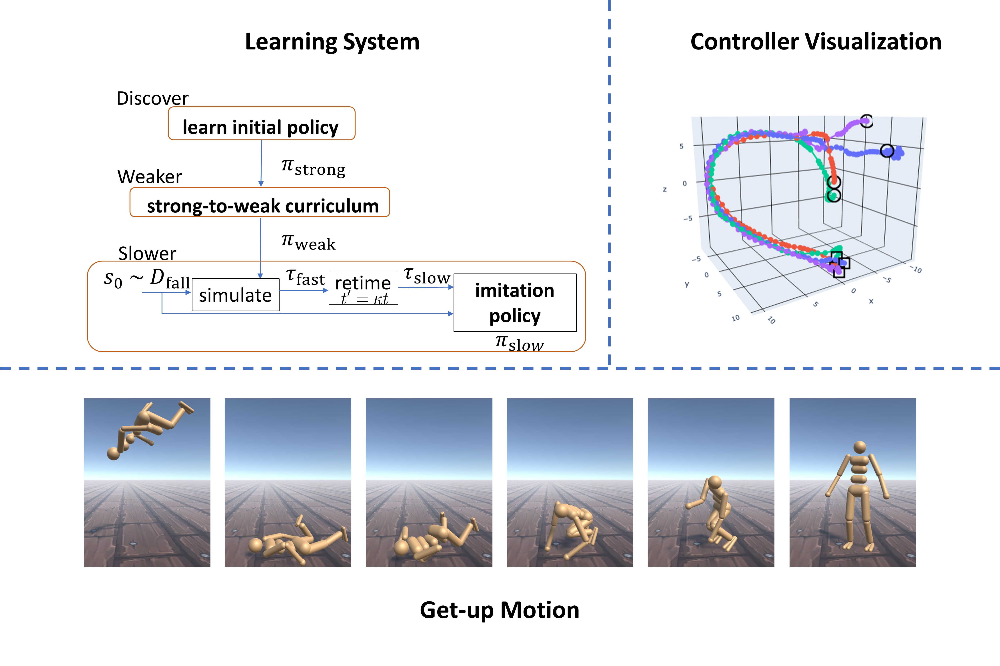

## Abstract

Getting up from an arbitrary fallen state is a basic human skill. Existing methods for learning this skill often generate highly dynamic and erratic get-up motions, which do not resemble human get-up strategies, or are based on tracking recorded human get-up motions. In this paper, we present a staged approach using reinforcement learning, without recourse to motion capture data. The method first takes advantage of a strong character model, which facilitates the discovery of solution modes. A second stage then learns to adapt the control policy to work with progressively weaker versions of the character. Finally, a third stage learns control policies that can reproduce the weaker get-up motions at much slower speeds. We show that across multiple runs, the method can discover a diverse variety of get-up strategies, and execute them at a variety of speeds. The results usually produce policies that use a final stand-up strategy that is common to the recovery motions seen from all initial states. However, we also find policies for which different strategies are seen for prone and supine initial fallen states. The learned get-up control strategies have significant static stability, i.e., they can be paused at a variety of points during the get-up motion. We further test our method on novel constrained scenarios, such as having a leg and an arm in a cast.

## Video

<div>
   <div style="position:relative;padding-top:56.25%;">
     <iframe style="position:absolute;top:0;left:0;width:100%;height:100%;" src="figs/video.mp4" frameborder="0" title="Supplementary Video"></iframe>
   </div>
</div>


Extra results: [link](https://drive.google.com/file/d/1Z4nSLxqnGSPbyDYNv2EI97FBPV6_xsVM/view?usp=sharing)

## Bibtex

Please consider citing our paper in your publications if the project helps your research.

```bibtex
@inproceedings{10.1145/3528233.3530697,
    author = {Tao, Tianxin and Wilson, Matthew and Gou, Ruiyu and van de Panne, Michiel},
    title = {Learning to Get Up},
    year = {2022},
    isbn = {9781450393379},
    publisher = {Association for Computing Machinery},
    address = {New York, NY, USA},
    url = {https://doi.org/10.1145/3528233.3530697},
    doi = {10.1145/3528233.3530697},
    booktitle = {ACM SIGGRAPH 2022 Conference Proceedings},
    articleno = {47},
    numpages = {10},
    keywords = {learning curriculum, Physics-based character animation},
    location = {Vancouver, BC, Canada},
    series = {SIGGRAPH '22}
}
```